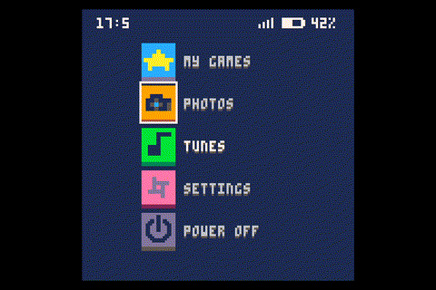
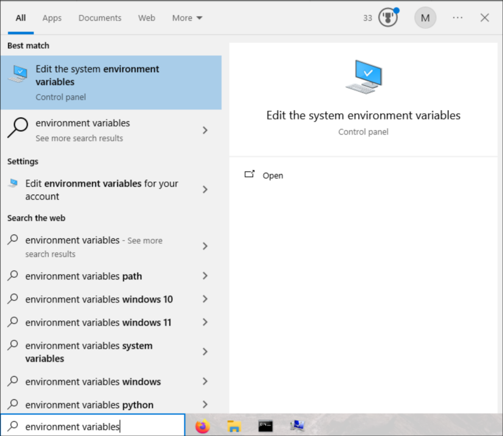
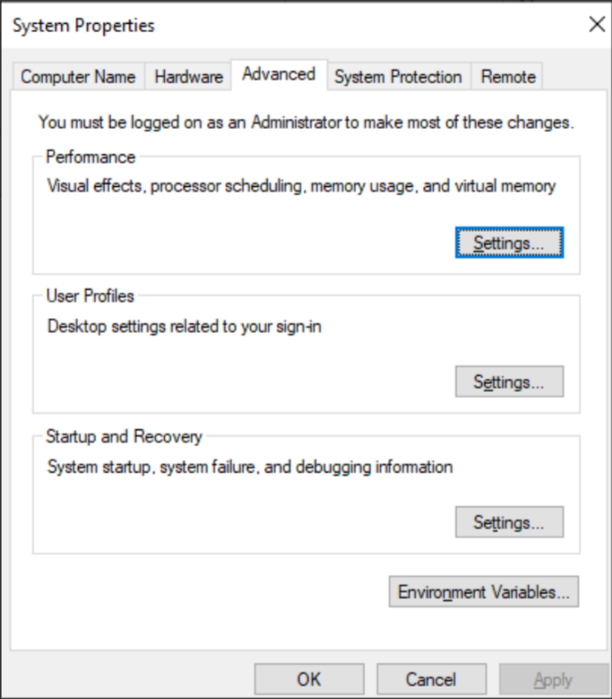
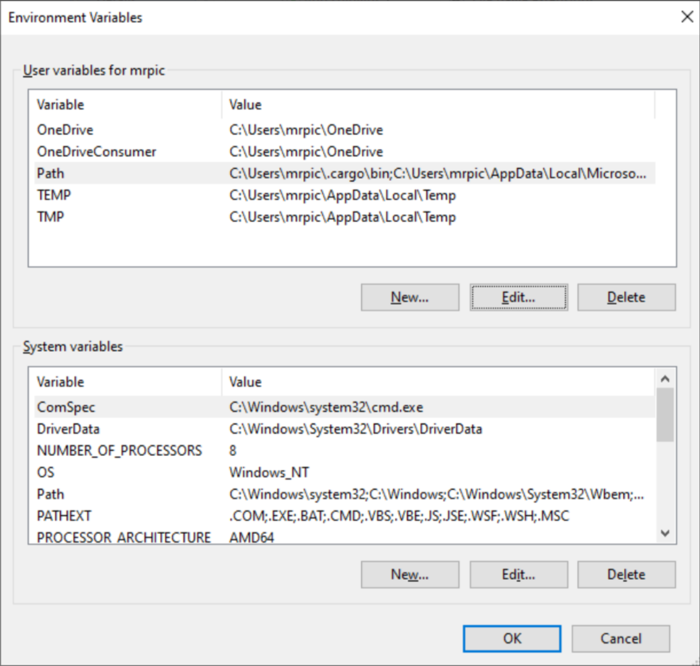
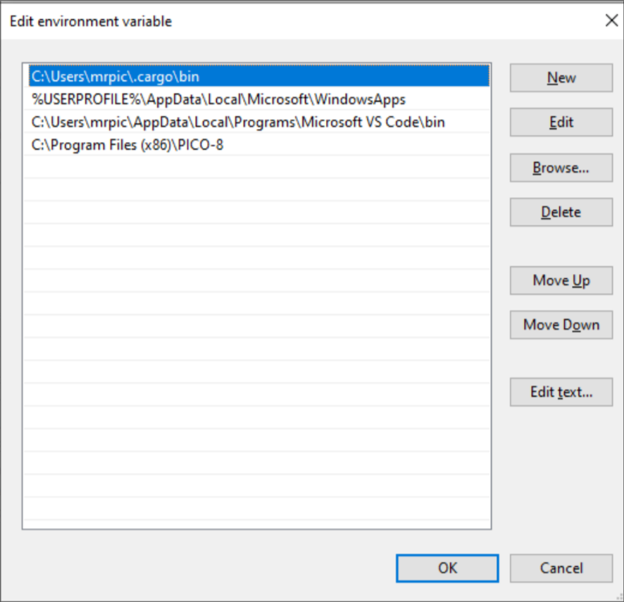

<div align="center">


PICO-8 powered games launcher for the [PeX Console](https://pex-labs.com/)

[](https://crates.io/crates/picolauncher)
[](https://docs.rs/picolauncher)
[](#)

</div>

**NOTE**: This project is still early access! There are many not implemented features, potential bugs, and cross platform support is still WIP! Bug reports and feature requests are greatly welcome! :))

**PicoLauncher** is a game launcher and 'operating system' for handheld consoles that run [PICO-8](https://www.lexaloffle.com/pico-8.php) natively. It seeks to streamline and revamp the PICO-8 gaming experience with features and apps like
- revamped SPLORE
- play paid games and apps too! (coming soon)
- photo gallery
- gif player (coming soon)
- music player
- settings/preferences app
- on screen keyboard (coming soon)
- physical cartridges (coming soon)

**PicoLauncher** is developed for the [PeX Console](https://pex-labs.com/) by PeX Labs, however in the future support may come for other devices. You can check current platform support [here](#supported-platforms).

<div style="display: flex; justify-content: space-between;">


</div>
<div style="display: flex; justify-content: space-between;">


</div>

## Supported platforms

|platform|support|
|---|---|
|linux x86_64|✅|
|linux armv7 (rpi)|✅|
|linux aarch64 (rpi)|✅|
|windows (64-bit)|🚧|

✅ - full support, 🚧 - WIP, ❌ - not (yet) supported

## Getting started

**PicoLauncher** requires an installed version of PICO-8 (if you don't have it, you can buy it [here](https://www.lexaloffle.com/pico-8.php?#getpico8)). You can either use a pre-compiled version from the [latest release](https://github.com/pex-labs/picolauncher/releases/latest) or build this project from source.

### Linux

<details>
<summary>click to expand</summary>

Download the latest pre-compiled binary titled `picolauncher-linux-x86_64.zip`. The unzip and navigate to the directory
```sh
unzip picolauncher-linux-x86_64.zip
cd picolauncher-linux-x86_64/
```

Next, ensure that `pico8` is included in your path. In your `.bashrc` or equivalent, add the line
```sh
export PATH="$PATH:<path to pico8 directory>"
```

For example
```sh
export PATH="$PATH:~/Downloads/pico-8/"
```

Chromium/Google chrome is now a dependency (temporarily), you can install it with
```sh
# Debian/Ubuntu
sudo apt-get install chromium-browser
# Arch
sudo pacman -S chromium
```

You can now run **PicoLauncher**:
```sh
./picolauncher
```

It is also possible to explicitly pass a binary to use to launch pico8 by setting the `PICO8_BINARY` environment variable:
```sh
PICO8_BINARY=<path to pico8 binary> ./picolauncher
```

For example
```sh
PICO8_BINARY=~/Downloads/pico-8/pico8 ./picolauncher
```

</details>

### Raspberry Pi

<details>
<summary>click to expand</summary>

First double check if you are running 64-bit or 32-bit Raspberry Pi OS.
```sh
uname -m
```

If the output of the above command is `aarch64`, you are 64-bit, and if the output is `armv7` or something similar, you are 32-bit. 

In the case that you are 64-bit, you should download the latest pre-compiled binary titled `picolauncher-linux-aarch64.zip`. Otherwise, download `picolauncher-linux-armv7.zip`. Similar to the above instructions, unzip and enter the directory
```sh
unzip picolauncher-linux-aarch64.zip
cd picolauncher-linux-aarch64/
```

Once again, add the pico8 directory to your PATH environment variables in your `.bashrc` or equivalent:
```sh
export PATH="$PATH:<path to pico8 directory>"
```

Chromium/Google chrome is now a dependency (temporarily), you can install it with
```sh
sudo apt-get install chromium-browser
```

When launching **PicoLauncher** and supplying the binary explicitly, if you are on 64-bit Raspberry Pi, ensure that you are using the `pico8_64` binary.

</details>


### Windows

⚠ Support co️ming in future ⚠
<!--details>
<summary>click to expand</summary>

Download the `picolauncher-windows.zip` zip file from the latest releases and unzip it. If your pico8 binary doesn't reside at the default location of `C:\Program Files (x86)\PICO-8\pico8.exe`, you need to set the environment variable `PICO8_BINARY` before launching.
```sh
set PICO8_BINARY=<path to pico8>
picolauncher.exe
```

You can also do this graphically. First search up 'Environment Variables' in your start menu.


Then in the 'System Properties' page, click the button titled 'Environment Variables...'


Locate the variable titled 'Path' and click the 'Edit' button.


Add a new path and set the value to the directory where you have installed pico8. If you used the windows installer for pico8, this should be set to `C:\Program Files (x86)\PICO-8\pico8.exe`


</details-->

### Build from source

To build from source, you need to have a [rust toolchain](https://www.rust-lang.org/tools/install) installed. To build **PicoLauncher** for all platforms, there is a provided build script at `dev/scripts/build-linux-x86_64.sh`, `dev/scripts/build-windows.sh`, etc. The built files are present in the `build/build-<platform>` directory, as well as zipped up in `build-<platform>.zip`. This is the same build that is distributed in the pre-compiled release.

## Adding custom games

**p8tool** (name pending) is a utility cli that has a couple of useful functions to interact with cartridge files. The most useful of these is the ability for to add your own games to the launcher. It will generate metadata files and extract the music for the music app.

```sh
p8tool addcart <path to cart> --name <name of cart> --author <author of cart>
```

## Contributing

Please see [CONTRIBUTING.md](CONTRIBUTING.md) for more details! Don't hesitate to report bugs and post feature requests!

## Credits

Pre-bundled games
- [birds with guns](https://www.lexaloffle.com/bbs/?tid=45334)
- [bun bun samurai](https://www.lexaloffle.com/bbs/?tid=54707)
- [celeste](https://www.lexaloffle.com/bbs/?tid=2145)
- [cherrybomb](https://www.lexaloffle.com/bbs/?tid=48986)
- [mot's grand prix](https://www.lexaloffle.com/bbs/?pid=97606)
- [oblivion eve](https://www.lexaloffle.com/bbs/?pid=142641)
- [pico night punkin'](https://www.lexaloffle.com/bbs/?tid=42715)
- [poom](https://www.lexaloffle.com/bbs/?pid=101541)
- [suika game demake](https://www.lexaloffle.com/bbs/?tid=54642)
- [swordfish](https://www.lexaloffle.com/bbs/?tid=31141)

